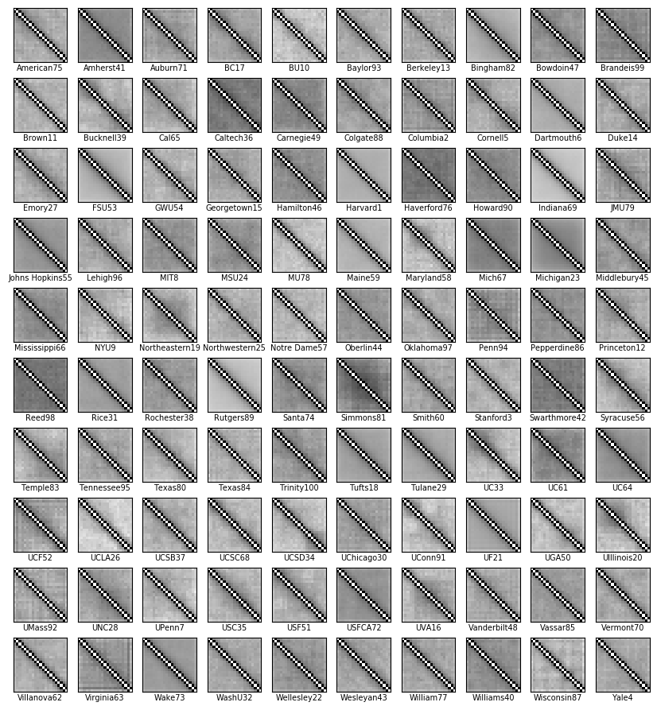
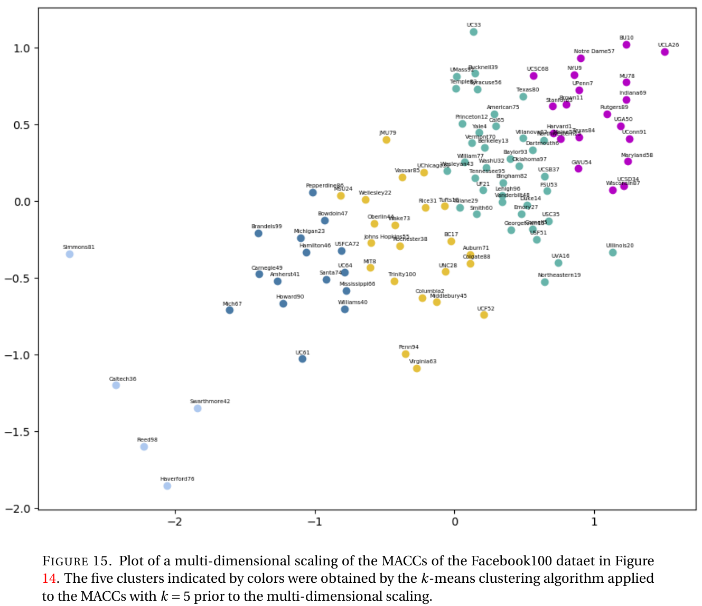
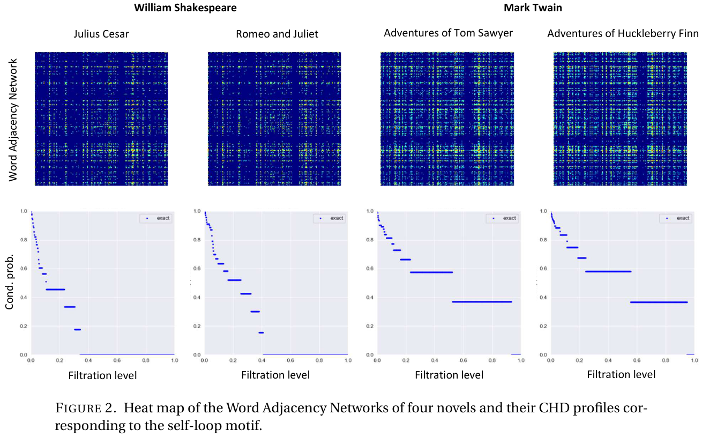

# Motif_sampling

MCMC algorithms for motif sampling and computing various CHD profiles of network data

## References

These codes are based on my paper below: 
  1. Hanbaek Lyu, Facundo Memoli, and David Sivakoff, 
     “Sampling random graph homomorphisms and applications to network data analysis.” 
     https://arxiv.org/abs/1910.09483
     
Word Adjacency Networks (WAN) data sets are due to Segarra et al. (Special thanks to Mark Eisen for sharing his data set and oringal code)

  2. Segarra, Santiago, Mark Eisen, and Alejandro Ribeiro. "Authorship attribution through function word adjacency networks." IEEE Transactions on Signal Processing 63.20 (2015): 5464-5478.
  

## File description 

  1. **dyn_emb.py** : MCMC algorithms for motif sampling and computing various CHD profiles of network data
  2. **dyn_emb_app.py** : Codes for applying dyn_emb.py to network data of matrix form
  3. **WAN_classifier.py**: Codes for computing CHD profiles, distance matrices, and classification rates for WAN dataset 
  4. **dyn_emb_facebook.py**: Codes for computing Matrics of Average Cluetering Coeficients (MACC) for the Facebook100 dataset
  
## Authors

* **Hanbaek Lyu** - *Initial work* - [Website](https://hanbaeklyu.com)

## License

This project is licensed under the MIT License - see the [LICENSE.md](LICENSE.md) file for details

